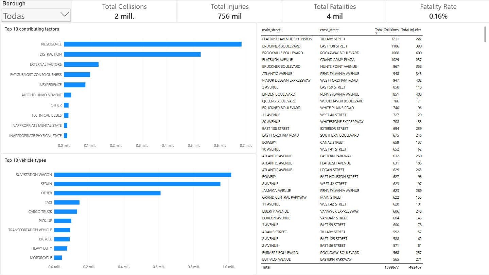

# NYC Motor Vehicle Collisions: ETL & Dashboard Analysis

## Overview
Analysis of  NYC traffic collisions to identify risk patterns, trends and hotspots.

## Key Findings

* **Borough volume:** Brooklyn registers the highest number of collisions across the city.  
* **Risk factors:** Negligence and distraction are among the most common causes of collisions.  
* **Severity metrics:** The fatality rate is 0.16%.  
* **Vehicle types:** The vehicle types most frequently involved in collisions are SUV/Station Wagon and Sedan.  
* **Critical location:** The most dangerous intersection is Flatbush Avenue and Tillary Street.  

## Data Modeling Architecture
**ETL processing:** Data cleaning, structuring and standardization of data were executed in PostgreSQL (version 18.3) using pgAdmin 4 interface.  
**Multidimensional Model:** A star schema was designed around a fact table (`fact_collisions`), three dimension tables (`dim_factors`, `dim_locations` and `dim_vehicles`) and two bridge views (`vw_fact_factors` and `vw_fact_vehicles`).  
**Power BI Integration:** Primary and foreign keys integrity was validated, enabling bridge views bidirectional filtering in order to guarantee correct filter propagation across many-to-many relationships.

## Visualization

## Repository Structure
* `01_raw_schema_setup.sql:` Creation of initial schema and raw data ingestion.  
* `02_data_profiling.sql:` Initial exploration and data quality profiling.  
* `03_data_cleaning.sql:` Transformation, cleaning and standardization towards relational modeling.  
* `04_eda_analysis.sql:` Aggregation queries and bridge views creation.  
* `05_nyc_collisions_dashboard.pbix:` Interactive dashboard designed in Power BI.  
